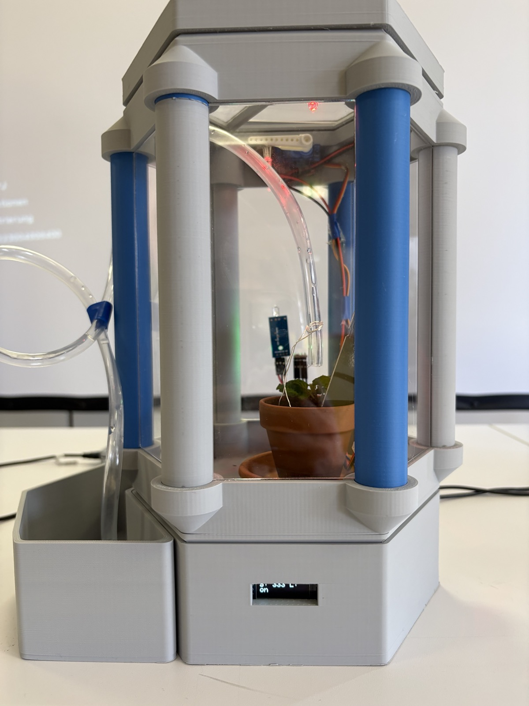
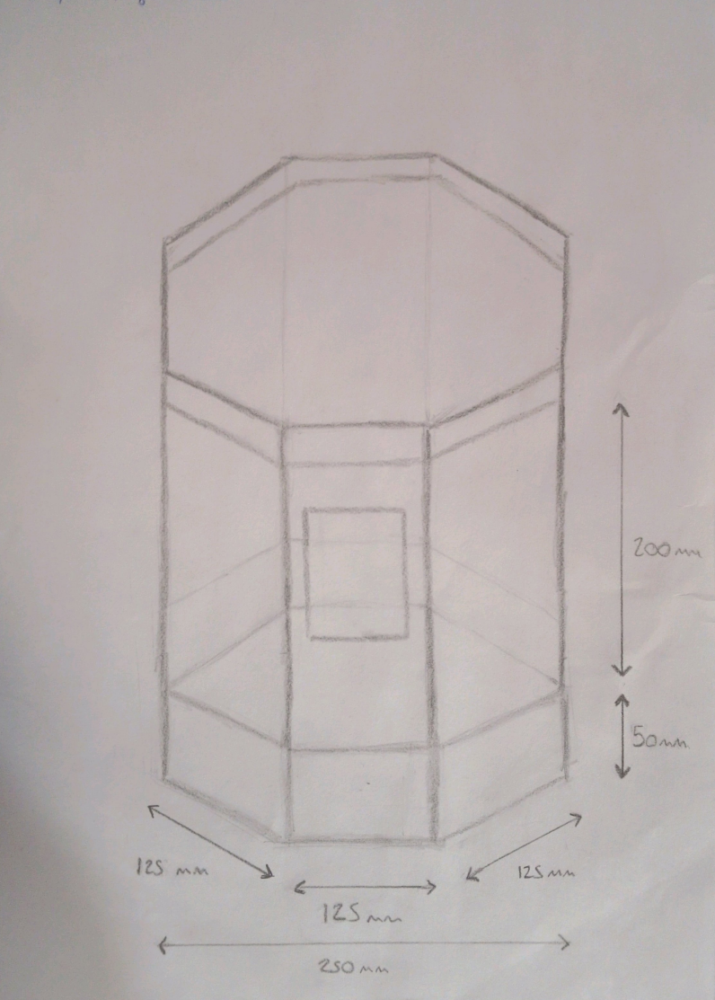

# Project Overview

The Greenhouse project is a smart, automated plant container engineered during the **Erasmus 2026** exchange program between German and Spanish students. Spanning a rigorous 3-week timeline, the objective was to construct an autonomous microclimate capsule that tracks critical environmental parameters and mechanically regulates the habitat without human intervention. 

## Prototype Sketch

The enclosure incorporates a sleek, modern design that is functionally optimized. It relies on an **Arduino Nano** microcontroller as the core logic unit and seamlessly integrates various digital and analog sensors. This provides real-time data on internal temperature, barometric pressure, air humidity, ambient light, and soil moisture. 

To react to these parameters, the greenhouse automatically executes mechanical and electronic tasks: watering the plants via a submerged dc-motor pump, adjusting physical ventilation by manipulating a window hinge with a servomotor, and activating an artificial RGB light cycle that transitions smoothly when the ambient light drops.

Designed to be both easily reproducible and modular, the greenhouse superstructure uses 3D-printed pillar joints and laser-cut transparent acrylic panes. The entire system can be snapped together, enabling disassembly for transport across international borders.