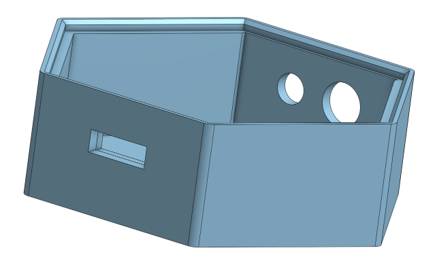
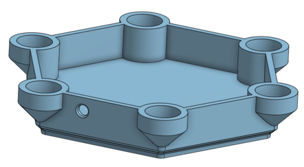
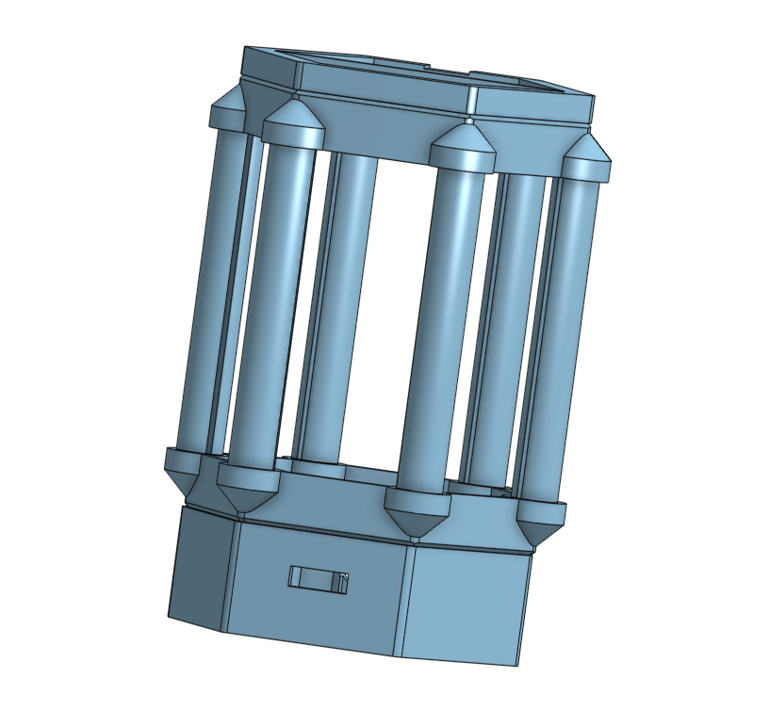
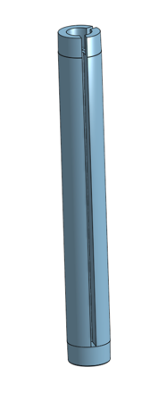
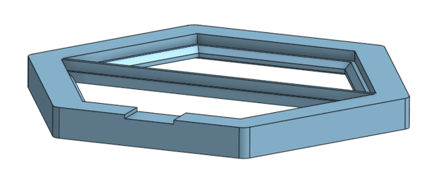
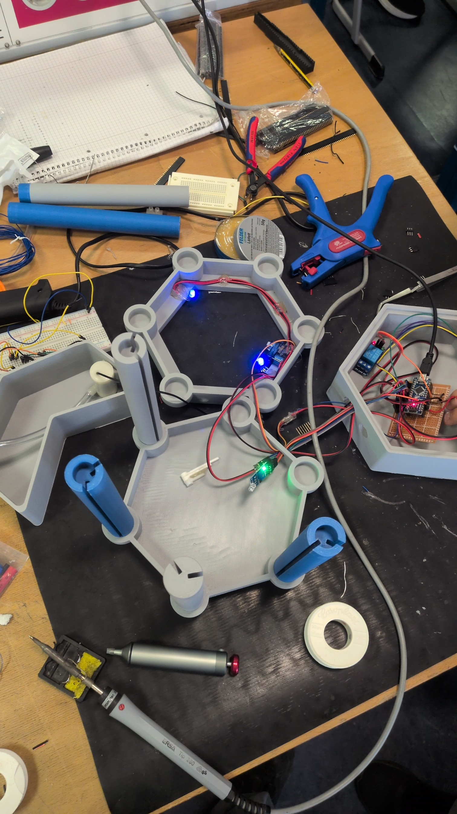
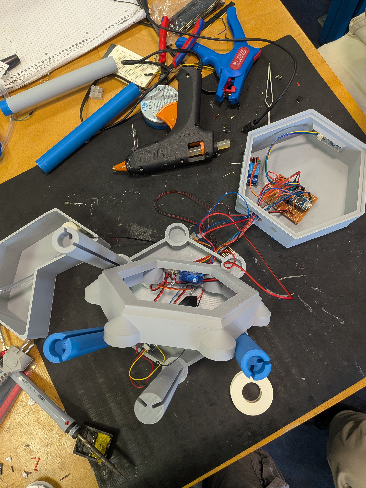
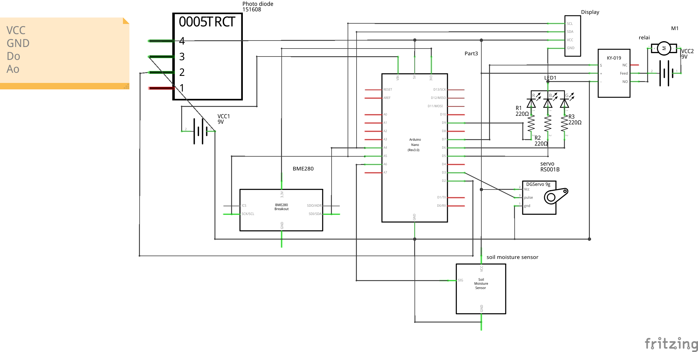

# Components and Hardware

The prototype employs multiple standalone input/output elements and runs natively on the Arduino Nano framework to leverage its robust digital, analog, I2C, and PWM capabilities.

## Microcontroller Stack

- **Arduino Nano Rev 3.0**: An ATmega328P microcontroller with an integrated dual-in-line package for breadboards and custom prototyping. Built-in pull-up resistors and a CH340 USB-to-serial converter form the backbone of the greenhouse logic functions.
- **Organic LED (OLED) 128x32**: Based on the versatile SSD1306 controller and operating over an I2C multi-drop topology (Address `0x3C`). The display shares the `SDA` (`A4`) and `SCL` (`A5`) pins and a stable `5V` logical supply to push 128x32 matrix characters effectively.

## Environmental Sensors

- **BME280 Breakout Module**: A precision component built predominantly by Bosch for environmental monitoring applications. Due to its I2C communication logic, it connects parallel to the OLED. Due to its precise logic levels, the breakout needs `3V3` instead of the general `5V` ring. It calculates the `Temperature`, `Humidity`, and `Barometric Pressure`, feeding them reliably with only an address-select modification (`0x76`).
- **Capacitive Soil Moisture Probe**: Instead of resistive contacts that suffer rapid corrosion, this capacitive breakout assesses moisture via variations in the dielectric constant of the wet/dry soil across its PCB traces, connected to the analog input `A6`.
- **Light Detection (Photodiode)**: The digital port `D2` listens to this comparator IC. Internally, a photodiode picks up infrared spectrum fluctuations and outputs a logical state directly determined through a tiny calibration potentiometer.

## Actuators and Actors

- **Water Pump and Flow System**: Driven via a `KY-019` solid-state relay triggered from the `D7` digital port. Due to power demands, a completely isolated `9V` battery circuit interfaces the primary `COM` and `NO` (Normally Open) relay terminal directly with the DC motor submerged beneath the primary acrylic layers.
- **Window Servo Motor (9g)**: Powered by internal PWM modulation on `D3`. A micro servo motor translates high-frequency rotational signals (mapped accurately from 0 to 180 degrees) via a 40mm fabricated mechanical arm that hinges the upper glass array manually without exceeding amperage thresholds on the main board.
- **RGB LEDs**: Driven over output lines `D9` (Red), `D6` (Green), and `D5` (Blue). Protective 220-ohm resistors ensure the integrated PWM sequences do not damage the diode junctions or microcontroller logic pins.

## 3D Printed Structural Components

The greenhouse housing is based on custom 3D-designed components intended for easy assembly, acting as structural pillars for the acrylic walls. Below are rendered overviews of these core elements:

- **Base Platform**: 
- **Plant Tray / Hexabase**: 
- **Hexa-Frame Structural Core**: 
- **Corner Pillars**: 
- **Roof Hinge Support**: 

## Early Assembly

Prototyping required rigorous breadboarding and physical wire routing prior to final enclosure integration.

*Initial wiring with logic checks.*

*Fitting the electronics within the 3D printed base parameters.*

*Digital schematic highlighting proper voltage references and pin layouts.*
